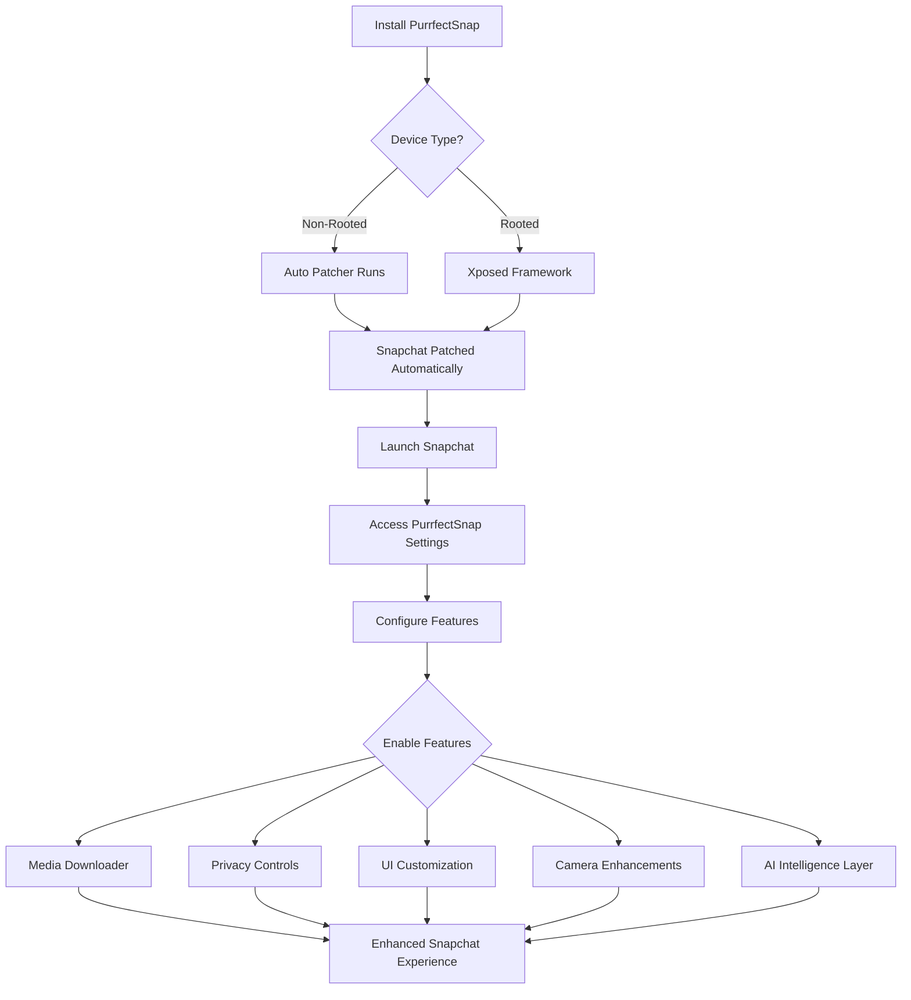

# PurrfectSnap

### An Xposed module meant to redefine your Snapchat experience! Works on both non-rooted and rooted devices!

 

[Installation](#installation) • [Features](#features) • [Changelog](#whats-new) • [Community](#community)

 

---

## Overview

PurrfectSnap is built on the foundation of SnapEnhance, pushing boundaries with innovative features and a refined user experience. This isn't just another fork; it's a complete reimagining of what's possible.

We're committed to active development, bringing you powerful tools that actually matter. Every feature is designed with real users in mind, not just for the sake of adding to a feature list.

 

## Philosophy

This project exists because we believe in continuous innovation. We're grateful to the original SnapEnhance team for their groundbreaking work, and we're building on that legacy by exploring new possibilities and listening to what the community actually wants.

No aggressive donation requests. No minimal changes disguised as “major updates.” Just genuine development driven by a passion for creating something exceptional.

 

---

 

## 🔄 How It Works

 

---

 

## Features

PurrfectSnap offers deep control across media, privacy, automation, and UI—designed for both casual users and power users.

<table>
<tr>
<td width="50%">

### Media Downloader
Advanced media management with extensive customization options for downloading and organizing content.

**Core Capabilities**
- Custom save locations and path formatting
- Automatic downloads from selected sources
- Profile picture downloads
- Voice note capture with format control
- FFmpeg integration for advanced processing

**Smart Features**
- Duplicate prevention with override option
- Overlay merging for combined content
- Custom logging for tracking downloads
- Context menu integration

</td>
<td width="50%">

### User Interface
Complete control over your interface with deep customization options.

**Visual Customization**
- Custom themes including AMOLED mode
- Configurable icon styles
- Message preview customization
- Bootstrap override for default tabs

**Interface Control**
- Hide unwanted UI components
- Enhanced friend map nametags
- Snap preview options
- Streak expiration info display
- Vertical story viewer
- Message indicators and stealth mode display

</td>
</tr>
<tr>
<td width="50%">

### Messaging
Privacy-focused messaging features with advanced control over your conversations.

**Privacy Tools**
- Screenshot bypass
- Anonymous story viewing
- Hide typing notifications
- Hide Bitmoji presence
- Prevent story rewatch indicators

**Enhanced Features**
- Unlimited snap view time
- Auto mark as read
- Conversation pinning (unlimited)
- Message logger with whitelist/blacklist
- Better notifications with blacklist support
- Double tap actions and reactions
- Message retention policy bypass

</td>
<td width="50%">

### Global Settings
System-wide enhancements that improve your overall experience.

**Performance**
- Better location handling
- Media upload quality control
- Custom video playback rates
- Default volume controls

**Optimization**
- Ad blocking
- Metrics disabling
- Story section control
- Video length restriction bypass
- Snap splitting disable
- Telecom framework control

</td>
</tr>
<tr>
<td width="50%">

### Camera
Professional-grade camera controls for content creation.

**Recording Options**
- Custom frame rates (front/back)
- HEVC recording support
- Custom resolution override
- Force camera source encoding

**Creative Control**
- Immersive preview mode
- Black photo option
- Startup default camera selection

</td>
<td width="50%">

### Rules Engine
Automation system for complex workflows.

- Stealth mode rules
- Auto download conditions
- Auto save parameters
- Auto open snap rules
- Unsaveable message settings

</td>
</tr>
<tr>
<td width="50%">

### Experimental
Cutting-edge features for power users.

**Advanced Tools**
- Native hooks for deep customization
- Spoofing capabilities
- Story logger
- Call recorder
- Account switcher
- App lock
- End-to-end encryption
- My Eyes Only passcode bypass

**Developer Features**
- Better transcript
- Friend notes
- COF experiments
- Custom streaks format
- Prevent forced logout

</td>
<td width="50%">

### Scripting
Extensibility through custom scripts.

- Developer mode
- Module folder management
- Auto reload capability
- Integrated UI
- Log control options
- Optimization toggles

</td>
</tr>
</table>

 

**Additional Features**

> **Streaks Reminder** — Configurable interval notifications with remaining time display and group notification support

> **Friend Tracker** — Event recording with background operation and automatic purge management

 

---

 

## What's New

Here's what makes PurrfectSnap different from upstream SnapEnhance.

 

### Aurora Design System

A complete visual language rebuilt from the ground up. Not just a theme, an entire design philosophy.

The interface now flows with purpose. Subtle animations guide your interactions. Every screen has been reconsidered, every transition refined. The result is an experience that feels premium without being ostentatious.

 

### PurrAura

The ban problem? Solved.

No more sacrificing features to stay safe. Add friends, block users, attach music; everything works as it should. No workarounds, no compromises, no disadvantages.

 

### Auto Patcher

Installation was complicated. Now it isn’t.

We've eliminated 90% of the installation friction. No Shizuku. No LSPatch. Just a straightforward process that respects your time.

 

### Intelligence Layer

**Auto Reply**  
Let AI handle routine responses while you focus on what matters. Configure automatic replies for chats, stories, and half-swipes. Essential for creators managing volume. Requires an API key from Google AI Studio, they offer free tier access.

**Scheduled Snaps**  
Time-shifted communication. Set a snap to send at midnight for a birthday. Queue content for optimal timing—your schedule, automated.

**Message Translator**  
Language barriers, eliminated. Incoming messages automatically translate to your preferred language. Set it once, communicate globally.

 

### Privacy Enhancements

**Granular Controls**  
Whitelist and blacklist modes for typing indicators and message logging. Choose exactly who sees what, friend by friend.

**Auto Delete Messages**  
Set expiration times for your messages. They disappear on your schedule, not Snapchat's.

**Message Logger Viewer**  
Review exported logs directly in-app. No external tools required.

 

### Data Persistence

**Friend Notes Backup**  
Your notes are valuable. Now they're protected. Export and restore with ease. Never lose context again.

 

### Device Management

**ID Spoofing**  
Device bans happen. Sometimes unjustly. We offer a solution for legitimate cases, approval required with proof of wrongful ban. This feature is restricted to prevent abuse.

**Model Spoofing**  
Identify as a high-end device model. Potential performance improvements, enhanced camera processing, and better feature access.

**Network Spoofing**  
Spoof your network status to Wi-Fi always to prevent several restrictions on mobile data.

 

### Restored Functionality

Features that disappeared? They're back.

Bulk messaging works again. Friend list management is fully operational. These aren't new features, they're restored capabilities that should never have been lost.

 

### Discovery

**Scripts Catalog**  
Browse and install scripts without leaving the app. No more hunting for import links. One-tap installation. Always current.

**Friend Tracker Catalog**  
Browse and install tracking rules without leaving the app. One-tap installation. Always current.

**Friend Tracker Import/Export**  
Backup and restore your Friend Tracker configurations with ease.

 

### Advanced Tracking

**I Can See You Rule**  
Track the exact time and duration when a friend enters your chat. Precision visibility tracking for Friend Tracker.

**Auto Open Snaps Enhancement**  
More granular control with queue size configuration and customizable delays.

 

### Visual Refinements

**AMOLED Theme**  
True black. Battery-saving. The most requested feature, delivered.

**Haptic Feedback**  
Subtle tactile responses. Every interaction confirmed through touch.

**Customizable Bottom Bar**  
Your navigation, your rules. Rearrange tabs, remove what you don't use, set your default view. Complete flexibility.

**Search History**  
Recently searched features, instantly accessible. No more hunting through menus.

 

### Infrastructure

**In-App Updates**  
New versions install directly from within the app. No GitHub hunting. No manual downloads. Just seamless updates.

**Update Notifications**  
Stay current automatically. Get notified when new releases are available.

**Config Export/Import Summary**  
See exactly which features a config will enable before importing or exporting. Know what you're getting.

 

### Quality

Hundreds of refinements you'll feel but might not see. Smoother animations. Faster response times. Eliminated edge cases. The kind of polish that separates good from exceptional.

> Some features are intended for educational, recovery, or accessibility purposes. Misuse may violate Snapchat’s terms of service.

 

---

 

## Installation

The guide is no longer needed!  
Just download and install PurrfectSnap from [here](https://github.com/particle-box/PurrfectSnap/releases). The app automatically detects your device type and applies the appropriate setup.

 

---

 

## Community

Questions? Ideas? Found a bug? Our community is active and responsive.

**[Telegram Channel](https://t.me/purrfectsnap_official)** — Announcements, discussions, and support
**For the discussions group link, refer to the description of the channel!**

 

---

 

## Contributing

We welcome contributions from developers who share our vision. Whether it's code, documentation, or design—quality contributions are always appreciated.

 

---

 

## Credits

PurrfectSnap is built with exceptional open source tools:

**Core Dependencies**
- [SnapEnhance](https://github.com/rhunk/SnapEnhance) — The foundation
- [libxposed](https://github.com/libxposed/api) — Framework integration
- [Dobby](https://github.com/jmpews/Dobby) — Native hooking

**Media Processing**
- [ffmpeg-kit-full-gpl](https://github.com/arthenica/ffmpeg-kit) — Media manipulation
- [coil](https://github.com/coil-kt/coil) — Image loading

**Scripting Engine**
- [rhino](https://github.com/mozilla/rhino) — JavaScript runtime
- [rhino-android](https://github.com/F43nd1r/rhino-android) — Android integration

**Utilities**
- [osmdroid](https://github.com/osmdroid/osmdroid) — Map functionality
- [libsu](https://github.com/topjohnwu/libsu) — Root operations
- [colorpicker-compose](https://github.com/skydoves/colorpicker-compose) — Color selection

 

---

 

Built with care, maintained with passion
Open source under GPL-3.0

 
 

